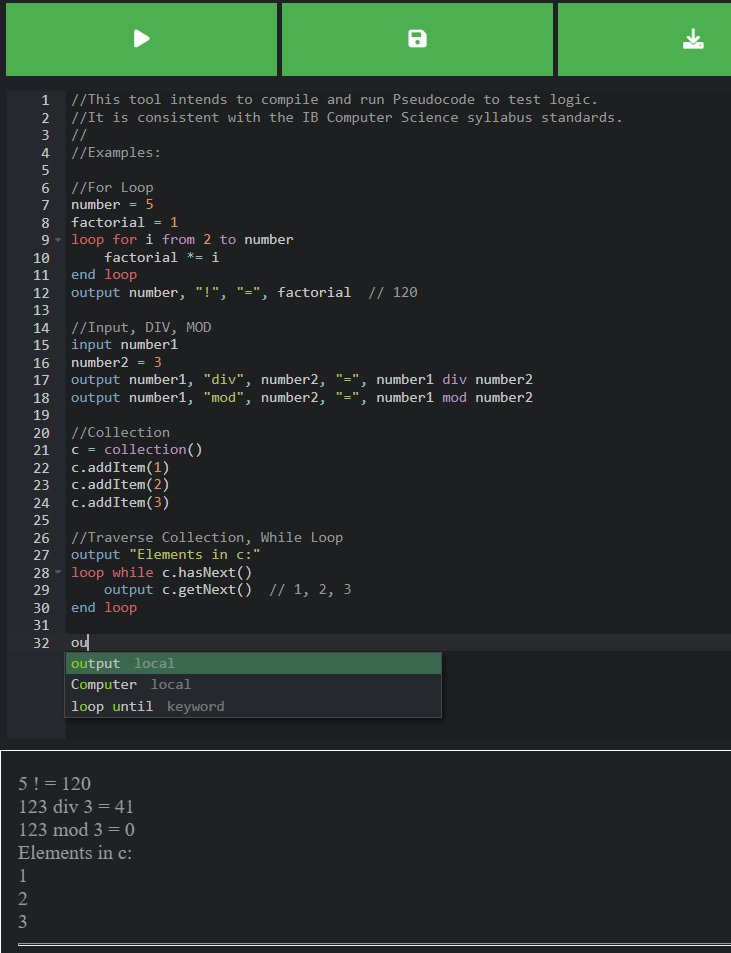
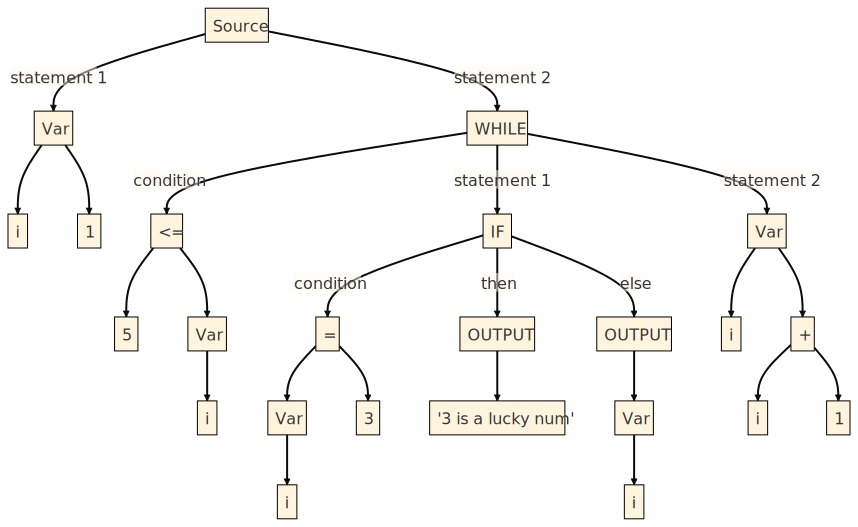
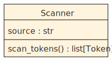
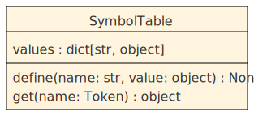
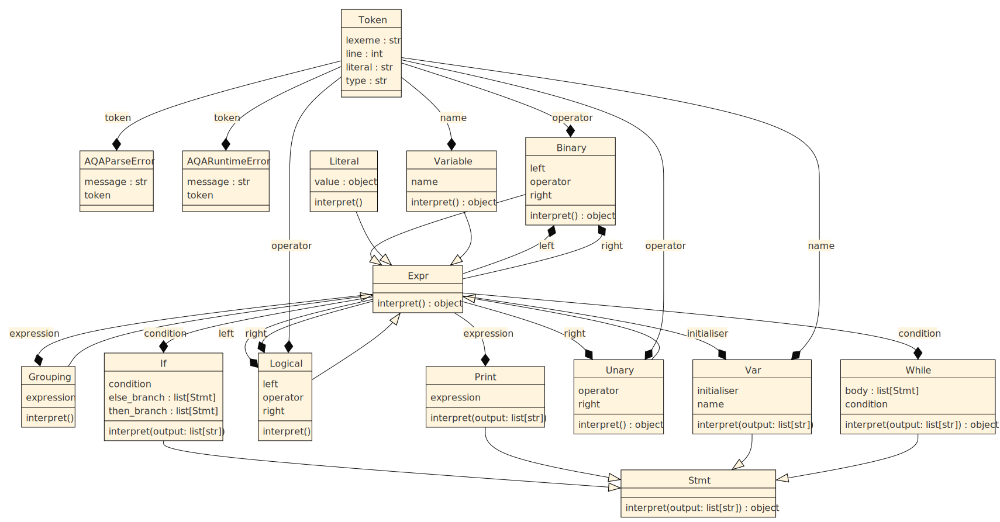
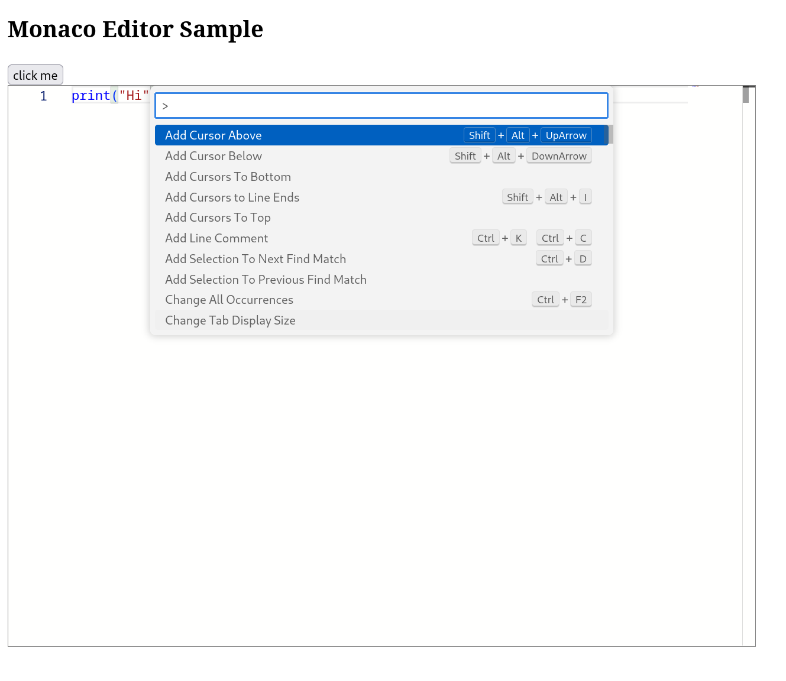

\pagebreak

# Analysis

## Background

Pseudo-code is a series of code like statements used to describe an existing algorithm or plan out a new one. Everyone has their own unique style of writing pseudo-code. It might look something like a recipe books with clear individual steps to follow. Or it could look something like an existing high level language, with compilers or interpreters already available.

Pseudo-code is 'problem-oriented', the idea being you first write your solution in pseudo-code, and then when the time comes to program a solution,  your brain is free to think about the specific implementation details of the chosen high-level language. Therefore, the purpose of writing pseudo-code is to prototype and plan.

However some people find writing pseudo-code may be tedious or boring, and would prefer going straight into an  interpreted weakly-typed scripting languages such as python or java-script that trade robustness for rapid iteration speeds, enabling faster prototyping.


**the imprecision of natural language**

Pseudo-code can also have ambiguity. For example some languages like lua start array indexing at `1` so `array[1]` returns the first element `"a"`.
``` {.lua .numberLines}
-- lua code
array = {"a", "b", "c"}
print(array[1])   -- prints`a`
```

However other languages like python start array indexing  at `0` so `array[1]` in this case returns the second element `"b"`

``` {.python .numberLines}
# python code
array = ["a", "b", "c"]
print(array[1])  # prints `b`
```

Imagine if both of these snippets where written in pseudo-code instead of a well defined language. It would be impossible to determine correctly whether the program was intended to print `a` or `b`. There are many other ways ambiguity can be introduced in pseudo-code, for example inclusive/exclusive for loops, rounding floats or the use of `Nil` or `None` types. 

However general purpose pseudo-code is very different to AQA's pseudo-code, which is both referred to as Pseudo-code and has strict rules. 

``` {.python .numberLines}
# AQA Pseudo-code
array = ["a", "b", "c"]
OUTPUT array[1]
```

Following the spec, arrays in AQA Pseudo-code start indexing at `0` so therefore the  is `b`.  Due to the consistency of the spec, we where  able to unambiguously determine the output. 

This consistency means that it would be possible to write a translator, that would take any set of pseudo-code following the AQA's style and convert it to the corresponding machine code. This blurs the lines between the pseudo-code and *real languages*.

## Justification

Some people may argue that a translator for AQA code would be unnecessary and would hinder students. It is mainly used for offline on-paper examinations without a computer. So having  a tool to generate machine code would not be needed as it  may confuse students to what the purpose of pseudo-code is. Furthermore where a working algorithm is needed it would be sufficient to manually translate AQA pseudo-code to an existing high level language where a compiler or translator is already available.

However I would argue that an AQA code translator would have real world uses not just as a research project. For example using this tool,  it would give students more experience and knowledge of AQA code, which would aid reading and comprehension skills. Moreover, it would mean that manually rewriting AQA code into another high level language for example python would be unheeded. And it would avoid the chances of bugs being introduced in the rewrite saving students a large amount of time.

It could also help teachers help teachers who could demonstrate automatically tracing an algorithm using a debugger or aid examiners in marking. However the problem is mainly begin solved for students to aid learning, so I will attempt to find a student as my primary client.


## Research

I have chosen to involve as student named Reece in year 10, who is interested in testing my project. He is currently studying GCSE computer science and intents to take the A level. A so, he will be my primary end user. To research this problem I have chosen to produce a Questionnaire to gauge his needs. The responses were collected in person and have been summarized.

1. **What is your opinion on AQA 'pseudo-code'?**
   
   Using 'pseudo-code' is useful for learning programming, However it is impractical to use.

2. **How would a pseudo-code interpreter be useful in learning?**
   
   'pseudo-code' is used on exam papers, so having a good understanding of it is important. A 'pseudo-code' interpreter could make it easier to get to grips with the language. 

3. **how important is performance?, or is usability a more important factor?**
   
   Usability is more important, the solution should be user friendly before being fast.

4. **Should the program work in vscode/pycharm or be an online IDE?**
   
   I personally use vscode, so a vscode extension would be nice, and would integrate with my workflow, but I know other people use pycharm, which are on school computers, or the online IDE called repl.it

5. **If you want an online IDE**
   
   1. **Should be the default colour scheme be light or dark?**
      
      Every programmer prefers dark theme.
   
   2. **What colours should the syntax highlighting be?**
      
      I use atom syntax highlighting, I even have an extension for it in vscode.

6. **How should the program display errors?**
   
   The interpreter should tell the user what line the error was found on, and ideally a clear description on how to fix it.

7. **Other requirements?**
   
   I would like a translucent background because they look cool.


## Analysis of research

Students that are interested in coding care a lot about aesthetics and developer experience. They expect tools like auto-completion and customizable themes to be present in any development environment they use. Specifically my client expects first class support in  vscode, pycharm and repl-it. However my goal will be to prioritize core language features and getting a working AQA pseudo-code translator before tackling the editor features my client requests.
Students that are interested in coding care a lot about aesthetics and developer experience. They expect tools like auto-completion and customizable themes to be present in any development environment they use. Specifically my client expects first class support in  vscode, pycharm and repl-it. However my goal will be to prioritize core language features and getting a working AQA pseudo-code translator before tackling the editor features my client requests.


## Background

There are three methods that could be used to convert AQA pseudo-code to machine code. Writing a **compilers**, **interpreters** or a **source-to-source compiler**. Compilers and interpreters produce a lower level representation of the source code, such as an  intermediary representation (IR) or machine code. A source-to-source compiler also known as a transpiler converts the source to a different high level language, for example converting AQA pseudo-code to python. Then if the resultant high-level language has a compiler or interpreter already available.

**compilers**


- **Compilers** first scan/tokenize the source code producing a list of tokens which are then parsed producing an intermediary format such as byte-code. This is then converted into *machine code*. For example the *clang* compiler for *C++* converts the source code to *LLVM byte-codes* which is then converted to standalone *machine code* for each system, for example *X-86*. However *Java byte-code* is distributed standalone and each system requires a *JVM* (Java Virtual Machine) installed to do the final conversion step to *machine code*.

- **Interpreters** scan and parse but the source code is executed statement by statement and converted to *machine code* on the fly. Interpreters are simpler to implement but can be slower than the final output of a compiled language.

- **Transpilers** scan and parse but the intermediary form is converted to another high level language where a compiler or interpreter already available. For example, the *Nim* programming language works by first transpiling to either *C*, *C++* or *Java-Script*.

- Other notes: languages can be expressed with regular grammar. Tools like yacc and lex are known as compiler compilers as they create a compiler given regular grammar of the language to be built as input. However I will not be using these and I am interesting in learning how a translator works.

**Advantages and disadvantages of each approach**

The advantages of a compiler is that is can optimize the resulting machine code, making the executable more efficient. However a disadvantage of machine code is that the machine code is not portable, and cannot be copied over to different systems. Furthermore,  the compilation step may take a large amount of time for complex projects, which means that errors, also will take a long time to show up. This reduces iteration speeds and can result in a worse developer experience than an interpreter where the errors show up much quicker. 

Therefore I will create an interpreter as its the simplest to implement and based on my user research usability and develop experience are more important factors than performance.


## Analysis of existing solutions

Currently, there are no existing solutions for translating AQA 'pseudo-code'. However, I found two translators for IB 'pseudo-code'. One of them is website called [EZ Pseudocode](http://ibcomp.fis.edu/pseudocode/pcode.html), It is officially endorsed by the IB computer science page. The website is written entirely in *HTML* and *Java Script*, including the translation logic. This makes running programs feel snappy as the *Java-script* code runs client-side and does not have to wait on a network request. Moreover the website has the ability to save and load programs from the browsers cookies which is a nice feature.

However as noted in the comments of the sample program, the algorithm works by transpiling the users code into  *Java-script* using a basic find and replace. This is not very robust and can lead to many bugs. For example, if the user enters `output "/ mod /"`, you would expect the string `"/ mod /"` to be printed out. However instead the string `/ % /` is printed out. This is because the `translate` function in the code calls `line.replace()` To fix this bug an algorithm would need to tokenize the input which is much more complicated. 

``` {.js .numberLines}
function translate(line) {
   line = line.replace(/ mod /g, " % ")    // The bug is here
    var lin = line.trim();
    var sp = lin.indexOf(" ");
    var first = "";
    if (startswith(lin, "if")) { first = "if" }
    ...
}

```
{width=85% align=centre}

\pagebreak

Another solution, also for IB 'pseudo-code' is written by [Dep Jain](https://pseudocode.deepjain.com/). It is much more complicated and includes syntax highlighting and auto-completions powered by an open source project code editor called [ace](https://github.com/ajaxorg/ace). It defaults to dark mode which makes the website easier on the eyes. It has large buttons on the top and also has the ability to save and load files from the users cookies similar to the previous program. However the web page makes a *HTTP* request to a server to translate the code, making it closed source and also slower than the previous solution.

{width=70% align=centre}

\pagebreak  <!-- this page break is so image goes on page    -->

Both programs are website, making it convenient as the user does not have to download any language tools. Website are also portable and can be accessed on any computer with an internet connection. Therefore I would consider developing a simple online IDE as well, second to a programmed solution.

Another disadvantage is that both solutions are limited to the IB computer science syllabus and not AQA's. Focusing my project on AQA's 'pseudo-code' will make my project unique. My solution should also be open source like the first example allowing the user to view the source code to better understand how their code was interpreted.

## Project Requirements

1. Create a tree-walk interpreter for all the features in AQA's 'pseudo-code' command set including but not limited to: 
   
   - `REPEAT`, `WHILE`, `FOR`, `IF`, `RECORD`, `SUBROUTINE` constructs
   
   - `INPUT`, `OUTPUT`, `LEN`, `POSITION`, `SUBSTRING`, `RANDOM_INT` functions
   
   - `STRING`, `INT`, `REAL`, `BOOL` types
   
   - `INPUT`, `OUTPUT` operations
   
   - variables, constants and arrays
   
   If it is not possible to implement all of these features, the the language should at least be Turing complete. For a language to be considered Turing complete it needs at lease arithmetic operations, control flow (`WHILE` / `REPEAT` loops), and access to arbitrary memory (arrays)

2. Additionally I would like to make keywords case insensitive giving the use the ability to style code to his preference.

3. The program should accept a large range of input. For example the 'pseudo-code' command set uses the unicode multiply sign `(×)` whereas most programming languages use an `(*)` as it can be typed on a traditional keyboard. My program should accept both of these symbols, making it adaptable. A table of these special symbols is show below.
   
   | Traditional | Unicode |
   | :---------: | :-----: |
   |      *      |   ×     |
   |      /      |   ÷     |
   |     !=      |  `!=`   |
   |     <=      |  `<=`   |
   |     >=      |  `>=`   |
   |     <-      |  `←`    |

4. Robust error handling, informing the user of what line syntax errors have occurred.

5. Create on online IDE for users to quickly try out the language without having to install any extra language tools their local machine.

6. Add syntax highlighting to highlight keywords and constructs, following the colours of the atom text editor, as it was my clients preference. 

\pagebreak

# Documented design

## Language Choice

To translate 'pseudo-code' I am going ot build a *tree-walk* interpreter. The rough structure of my implementation is based on a book called *Crafting Interpreters* (ISBN 9780990582939) by *Robert Nystrom* which is written in *Java*. I have decided to use *Python* instead as it has a simple and readable syntax and is dynamically typed. This means I can re-use *python's* base types, which support string concatenation and integers of arbitrary precision meaning that integers will never overflow. *Python's* slower performance is not an issue as having a robust solution is higher priority and python is widely understood and is a popular language. Python is also multi-paradigm and supports OOP programming which is the main language feature I will use to structure my code. I also intend to use modules and split my code across multiple files to separate concerns.

## Addresssing redundancy

Python has a number of langauge features and libraries to help write more concise code. 

# Rule 1
\_\_Description\_\_ for rule 1.

\Begin{multicols}{2}
## Good
```c
int foo (void) 
{
    int i;
}
```

## Bad
```c
int foo (void) {
    int i;
}
```
\End{multicols}

## High level system overview

Converting 'pseudo-code' to *machine code* is comprised of several stages. After the user's source code is read in from a file or *stdin* it is stored in a variable of type string and resides in memory. The first main stage is known as scanning of tokenizing where the alphabet of characters are grouped together to form tokens that represent the grammar and punctuation of the language.

During this stage lexical analysis is performed to group the right amount of characters into the right token. Some tokens are made up of single characters such as  (+) and (-). Whereas other tokens are made up of a set number of characters  such as FOR and IF.

STRING and  NUMBER literals are made up of a variable number of characters and need to be handled correctly. If the number 3 is found inside of a string, it should be treated as part of the STRING literal and not its own NUMBER literal. Therefore our scanner program will need to treat the same character differently depending on its state such as whether it has seen an opening `"` or `'`. The NUMBER literals include floats so the scanner should also handle decimal points correctly.

**Source code**

``` {.aqa .numberLines}
   IDENTIFIER `i`
         |  ╭───── ASSIGNMENT token
         ↓  ↓
         i <- 1
         WHILE i <= 5
             IF i = 3                          ←─ INTEGER literal
                 OUTPUT "3 is a lucky number"  ←─ STRING literal
             ELSE                              ←─ ELSE token
                 OUTPUT i                      ←─ IDENTIFIER token
             ENDIF                             ←─ ENDIF token
             i <- i + 1
         ENDWHILE                              ←─ ENDWHILE token
```

**Table of tokens**

| Token      |         Value         |
| :--------- | :-------------------: |
| IDENTIFIER |          'i'          |
| ASSIGNMENT |                       |
| NUMBER     |           1           |
| WHILE      |                       |
| IDENTIFIER |          'i'          |
| LESS_EQUAL |                       |
| NUMBER     |           5           |
| IF         |                       |
| IDENTIFIER |                       |
| EQUAL      |                       |
| NUMBER     |           3           |
| PRINT      |                       |
| STRING     | '3 is a lucky number' |
| ELSE       |                       |
| PRINT      |                       |
| IDENTIFIER |          'i'          |
| END        |                       |
| IDENTIFIER |          'i'          |
| ASSIGNMENT |                       |
| IDENTIFIER |          'i'          |
| ADD        |                       |
| NUMBER     |           1           |
| END        |                       |
| EOF        |                       |


**Abstract Syntax Tree**

Looking in the table, the scanner has produced 18 separate tokens including an EOF (End Of File) token. The variable `i` also given a special  IDENTIFIER token. We can use a hashmap  data structure to store the value of `i` as it is incremented at the end of the for loop, so that it is printed correctly on the fifth line.

**Parsing**

The next step is parsing, where we convert the alphabet of tokens into expressions.  This will be modelled using an as an Abstract Syntax Tree (AST). This nesting of the nodes inside a tree allows us to represent the nesting or or `FOR` and `IF` blocks. As well as correctly defining the order of operations of expressions following BIDMAS.

To do this the parser could use two possible methods to recognize the start and end of out `FOR` and `IF` blocks. Method 1 involves counting indentation levels which would require our scanner to emit INDENT tokens matching tab character or spaces. This can be complicated and erroneous where the user inconsistently mixes tabs and spaces. However, it would make the use of `ENFOR` and `ENDIF` keywords optional. 
To do this the parser could use two possible methods to recognize the start and end of out `FOR` and `IF` blocks. Method 1 involves counting indentation levels which would require our scanner to emit INDENT tokens matching tab character or spaces. This can be complicated and erroneous where the user inconsistently mixes tabs and spaces. However, it would make the use of `ENFOR` and `ENDIF` keywords optional. 

The second method is completely ignoring the indentation and only looking at the `ENDFOR` and `ENDIF` to determine the end of our `FOR` and `IF` blocks. This is simpler and less error-prone as it makes leading spaces or tab optional, but the user can still include them for readability. Therefore, this is the design i'll chose to use.

That aside, after parsing our AST looks like this:



During this stage the parser performs syntactic analysis, mapping tokens to `WHILE` and `IF` The parser sees a `WHILE` token so it knows what follows has to be a condition. Every statement thereafter is nested inside of the `WHILE` block until the parser sees the `ENDWHILE` token, A Tree data structure to represent the order of operations. The final stage is interpreting this tree.

The tree is interpreted from the leaves to the root. The source doe is made up of two statements. The first is the variable declaration `i <- 1` and the next is the `WHILE` loop. The while loop is then made of the condition `i <= 5` and two statements. The two statements are the `IF` statement and another assignment `i <- i + 1`. The `IF` statement also consists of a condition `i = 3`, only a single `=` and not a double `==`. This is because an `<-` is used as the assignment operator, and so the comparison operator hence is a single equal sign, compared to other languages. The `IF` statement has a then and else branch each consisting of a single `OUTPUT` statement. Each construct like the `WHILE` and the `IF` can nest any amount of statements.

A symbol table is used to keep track of the `i` variable as its value changes throughout the program. From here instead of traversing the tree and emitting byte code, we'll take a simpler but less efficient approach and run the python equivalent for each statement. So the `OUTPUT` is then mapped to the python `print()` statement.

## Language syntax

Backus-naur (BNF) is useful notation for describing the grammar of languages. BNF is a series of rules, consisting of a head and a body making up a production. The head is on the LHS of the `'::='` and the body is on RHS of the `'::='`. A rule can either be *terminal* or *non-terminal*. A *terminal* production matches string literals, number literals or tokens. A *non-terminal* production matches other rules. Note: keywords are case insensitive so `PRINT` or `print` or any other casing is perfectly valid. Although this gives the user less options for valid variable names, this gives the language more flexibility in the valid source code it accepts. Each BNF statement will be accompanied by a syntax diagram, for a clearer explanation.

Moreover the meta-characters `(*)`,  `(?)` and `(|)` will be used. The `(*)` means zero or more, the `(?)` means zero or one and the `(|)` means or.

`<program> ::= <declarations> "EOF"`


`<declarations> ::= <declaration>*`


`<declaration> ::= (<variable_declaration> | <statement>)?`


`<statement> ::= (<printStatement> | < whileStatement> | <forStatement> | <ifStatement>)?`  

  

`<variable declaration> ::= "IDENTIFIER" "<-" <expression>`

  

`<end> ::= "END" | "ENDIF" | "ENDWHILE" | "ENDFOR"`

  

`<printStatement> ::= ( "OUTPUT" | "PRINT" ) <expression>`

  

`<ifStatement> ::= "IF" <expression> ("THEN" | ":")? <declarations> ("ELSE" ":"? <declarations>)? <end>`  


`<whileStatement> ::= "WHILE" <expression> ("THEN" | ":")? <declarations> <end> `


`<forStatement> ::= "FOR" <variable declaration> "TO" <expression> ("STEP" <expression>)? <declarations> <end>`


`<expression> ::= <logic_or>`


`<logic or> ::=  <logic and> ( OR <logic and> )*`


`<logic and> ::=  <equality ( AND <equality> )*`


`<equality> ::=  <comparison> ( ( "==" | "!=" ) <comparison> )*`


`<comparison> ::=  <term> ( ( ">" | ">=" | "<" | "<=" ) <term> )*`


`<term> ::=  <factor> ( ( "-" | "+" ) <factor> )*`


`<factor> ::=  <unary> ( ( "/" | "*" ) <unary> )*`


`<unary> ::=   ( NOT | "-" ) <unary> |  <primary>`


`<primary> ::=   INTEGER | REAL | STRING | None | True | False | "(" <expression> ")"`


## User Interface

My program will have a basic command line interface. It should let the user pick from running the program via the Read Eval Print Loop (REPl), passing in the program as a string, or reading in the program as a file. The program should also display a helpful message when the program is called with the `---help` flag. Below shows a draft of what this might look like.

``` {.bash .numberLines}
# display help message
$ python aqainterpreter.py --help
Usage: aqainterpreter.py [OPTIONS] [FILENAME]

Options:
  -c, --cmd TEXT
  --help          Show this message and exit.


# incorrect usage
$ python aqainterpreter.py filename -c cmd
Usage: aqainterpreter.py [OPTIONS] [FILENAME]
Try 'aqainterpreter.py --help' for help.

Error: cannot specify both filename and cmd at same time

# starting the repl (read-eval-print-loop)
$ python aqainterpreter.py
> OUTPUT 'Hi!'
Hi!

# program read in from file
$ python aqainterpreter.py input.txt
Hi!

# program passed in as a string
$ python aqainterpreter.py --cmd "OUTPUT 'Hi!'"
Hi!
```


\pagebreak
# Technical Solution

**module hierarchy**

{ width=30% }

**Class diagrams**

{ width=30% }
{ width=20% }
{ width=30% }



## project structure

\TECHNICAL_SOLUTION

## syntax highlighting

Another one my clients needs was to produce syntax highlighting for the vscode editor. Due to time limitations, I instead prioritised the syntax highlighting of the code snippets in this document. This document was produced in pandoc which accepts KDE-style XML syntax definition files so I wrote one AQA pseudo-code. Unfortunately I couldn't get comments to work which is why AQA pseudo-code comments appear black in this documents whereas they appear green in python snippets. The XML file below contains regular expressions and is a lot more of a declarative style compared to the tokenizer and parse I wrote in python. In fact its only 114 lines compared to my scanner which is 203.

**aqa.xml**
``` {.xml .numberLines}
<?xml version="1.0" encoding="UTF-8"?>
<!DOCTYPE language>
<language name="AQA" section="Markup" version="7" kateversion="2.4"
  extensions="*.aqa" mimetype="application/json">
  <highlighting>
    <list name="Constants">
      <item>NOT</item>
      <item>TRUE</item>
      <item>FALSE</item>
      <item>NONE</item>
      <item>AND</item>
      <item>OR</item>
      <item>THEN</item>
      <item>WHILE</item>
      <item>DO</item>
      <item>END</item>
      <item>ENDIF</item>
      <item>ENDWHILE</item>
      <item>ENDFOR</item>
      <item>FOR</item>
      <item>TO</item>
      <item>STEP</item>
      <item>IDENTIFIER</item>
      <item>EOF</item>
    </list>
    <list name="Built_In">
      <item>OUTPUT</item>
      <item>PRINT</item>
    </list>
    <list name="Control_Flow">
      <item>IF</item>
      <item>ELSE</item>
    </list>
    <list name="Data_Types">
      <item>INTEGER</item>
      <item>REAL</item>
      <item>STRING</item>
    </list>
    <list name="Operators">
      <item> +  </item>
      <item> -  </item>
      <item> *  </item>
      <item> ×  </item>
      <item> /  </item>
      <item> ÷  </item>
      <item> =  </item>
      <item> >  </item>
      <item> ≥  </item>
      <item> >= </item>
      <item> ≤  </item>
      <item> ≠  </item>
      <item> != </item>
    </list>

    <contexts>

      <context name="Normal" lineEndContext="#stay">
        <DetectChar char="&quot;" context="String_Value"
          attribute="Style_String_Value"/>
        <DetectChar char="&quot;" context="String_Value"
          attribute="Style_String_Value"/>

        <DetectSpaces context="#stay" attribute="Style_Normal" />

        <keyword String="Constants"    context="#stay" attribute="Style_Keyword"/>
        <keyword String="Built_In"     context="#stay" attribute="Style_Function"/>
        <keyword String="Control_Flow" context="#stay" attribute="Style_Control_Flow"/>
        <keyword String="Data_Types"   context="#stay" attribute="Style_String_Key"/>
        <keyword String="Operators"    context="#stay" attribute="Style_Operator"/>
        <DetectChar char="&lt;&lt;"    context="#stay" attribute="Style_Operator"/>

        <RegExpr String="-?[0-9]+\.[0-9]+(?:[eE][+-]?[0-9]+)?" context="#stay"
          attribute="Style_Float" />
        <RegExpr String="-?[0-9]+(?:[eE][+-]?[0-9]+)?" context="#stay"
          attribute="Style_Decimal"/>
      </context>

      <context name="String_Value" lineEndContext="#pop" attribute="Style_String_Value">
        <DetectChar char="&quot;"  context="#pop" attribute="Style_String_Value" />
        <RegExpr String="\\(?:[&quot;\\/bfnrt]|u[0-9a-fA-f]{4})" context="#stay"
          attribute="Style_String_Value_Char" />
      </context>

      <!-- <context name="Comment" lineEndContext="#pop" attribute="Style_Comment">
        <RegExpr String="." attribute="Style_Comment">
      </context> -->
    </contexts>

    <itemDatas>
      <itemData name="Style_Normal"             defStyleNum="dsNormal" />
      <itemData name="Style_Comment"            defStyleNum="dsComment" />

      <itemData name="Style_Decimal"            defStyleNum="dsDecVal" />
      <itemData name="Style_Float"              defStyleNum="dsFloat" />
      <itemData name="Style_String_Key"         defStyleNum="dsDataType" />
      <itemData name="Style_String_Value"       defStyleNum="dsString" />
      <itemData name="Style_Control_Flow"       defStyleNum="dsControlFlow" />
      <itemData name="Style_Function"           defStyleNum="dsFunction" />
      <itemData name="Style_Operator"           defStyleNum="dsOperator" />
      <itemData name="Style_String_Value_Char"  defStyleNum="dsChar" />

      <itemData name="Style_Keyword"            defStyleNum="dsKeyword" />

    </itemDatas>
  </highlighting>

  <general>
    <comments>
      <comment name="singleLine" start="#"/>
    </comments>
    <keywords casesensitive="0"/>
  </general>

</language>
```

Then to load this file into pandoc, the document generator used to create this document I use the following command.

``` {.bash .numberLines}
pandoc metadata.yaml report.md \
        --output=out.pdf \
        --syntax-definition=aqa.xml \
        --pdf-engine=xelatex \
        --table-of-contents \
        --number-sections
```

`metedata.yaml` describes extra information such as the headers and footers used in this document. And `aqa.xml` is the KDE style XML file previously.

\pagebreak
# Testing

To perform quality assurance on my project, I created several unit tests inside of the `test_.py` file. These tests where run using pythons `pytest` library. The `pytest` library automatically runs all functions and files prefixed with `test_` hence the strange name `test_.py`. Here is a more detailed snippet of all the code samples that where used as testing. However as the set of string matched by a context free grammar is infinite, it is impossible to test every pseudo-code input that can be run by my program. Therefore my testing covers the main language features I managed to implement and a couple extra pseudo-code programs that make use of multiple language features at once.

## testing expressions

``` {.aqa .numberLines}
OUTPUT 1 + 1  # 2
OUTPUT 1 - 1  # 0
OUTPUT -1     # -1
OUTPUT 2 * 1  # 2
OUTPUT 2 × 1  # 2
OUTPUT 2 / 1  # 2.0
OUTPUT 2 ÷ 1  # 2.0

OUTPUT "hi" + "÷"  # "hi÷"
OUTPUT "a" * 3     # "aaa"

OUTPUT 1 > 0    # True
OUTPUT 1 ≥ 0    # True
OUTPUT 1 >= 1   # True
OUTPUT 1 < 0    # False
OUTPUT 1 ≤ 0    # False
OUTPUT 1 <= 1   # True
```

## testing comments
``` {.aqa .numberLines}
# a comments
```

## testing assignment
``` {.aqa .numberLines}
a <- 0
a <- a + 1
OUTPUT a   # 1
```

## testing assignment
``` {.aqa .numberLines}
IF True
   OUTPUT "yes"
ENDIF  # yes

IF False
   OUTPUT "yes"
ENDIF  # "yes"

IF True
   IF True
      OUTPUT "yes"
   ENDIF
ENDIF  # "yes"
```

## testing while loops
``` {.aqa .numberLines}
a <- 1
WHILE a <= 3 DO
   OUTPUT a
   a <- a + 1
ENDWHILE  # 1, 2, 3

# fibonacci sequence
a <- 1
b <- 1
c <- 2
count <- 0
WHILE count != 2
    OUTPUT a
    a <- b + c
    OUTPUT b
    b <- c + a
    OUTPUT c
    c <- a + b
    count <- count + 1
ENDWHILE  # 1, 1, 2, 3, 5, 8 
```

## testing for loops
``` {.aqa .numberLines}
FOR a <- 1 TO 1
   OUTPUT a
ENDFOR # 1

FOR a <- 1 TO 1 STEP 1
   OUTPUT a
ENDFOR # 1

FOR a <- 1 TO 1 STEP -1
   OUTPUT a
ENDFOR # 1

FOR a <- 1 TO 3
   OUTPUT a
ENDFOR # 1, 2, 3

FOR a <- 1 TO 3 STEP 1
   OUTPUT a
ENDFOR # 1, 2, 3

FOR a <- 3 TO 1
   OUTPUT a
ENDFOR # 3, 2, 1

FOR a <- 3 TO 1 STEP -1
   OUTPUT a
ENDFOR # 3, 2, 1

FOR a <- 1 TO 5 STEP 2
   OUTPUT a
ENDFOR # 1, 3, 5

FOR a <- 5 TO 1 STEP -2
   OUTPUT a
ENDFOR # 5, 3, 1

FOR a <- 1 TO 2
   FOR b <- 1 TO 2
       OUTPUT a
       OUTPUT b
       OUTPUT ''
   ENDFOR
ENDFOR  # 1,1  1,2  2,1  2,2

FOR a <- 1 TO 12
    FOR b <- 1 TO 12
        OUTPUT a + " × " + b + " = " + (a * b)
    END
END
# 1 × 1 = 1
# 1 × 2 = 2
# 1 × 3 = 3
# 1 × 4 = 4
# 1 × 5 = 5
# 1 × 6 = 6
# ... all the times tables up to 12 × 12
```

## Tokens and AST

Here are the tokens and the ast generated by my program for a couple of the tests as showing them all would be too long.

### program 1

``` {.aqa .numberLines}
OUTPUT 1 + 2 * 3
```

**tokens**
``` {.python .numberLines}
[Token(type='PRINT', lexeme='OUTPUT', line=1),
 Token(type='NUMBER', lexeme='1', line=1),
 Token(type='ADD', lexeme='', line=1),
 Token(type='NUMBER', lexeme='2', line=1),
 Token(type='TIMES', lexeme='', line=1),
 Token(type='NUMBER', lexeme='3', line=1),
 Token(type='EOF', lexeme='', line=2)]
```

**ast**
``` {.python .numberLines}
[
    Print(
        expression=Binary(
            left=Literal(value=1),
            operator=Token(type="ADD", lexeme="", line=1),
            right=Binary(
                left=Literal(value=2),
                operator=Token(type="TIMES", lexeme="", line=1),
                right=Literal(value=3),
            ),
        )
    )
]
```

### program 2

``` {.aqa .numberLines}
IF True
   IF True
      OUTPUT "yes"
   ENDIF
ENDIF
```

**tokens**
``` {.python .numberLines}
[Token(type='IF', lexeme='IF', line=1),
 Token(type='TRUE', lexeme='True', line=1),
 Token(type='IF', lexeme='IF', line=2),
 Token(type='TRUE', lexeme='True', line=2),
 Token(type='PRINT', lexeme='OUTPUT', line=3),
 Token(type='STRING', lexeme='"yes"', line=3),
 Token(type='END', lexeme='ENDIF', line=4),
 Token(type='END', lexeme='ENDIF', line=5),
 Token(type='EOF', lexeme='', line=6)]
```

**ast**
``` {.python .numberLines}
[
    If(
        condition=Literal(value=True),
        then_branch=[
            If(
                condition=Literal(value=True),
                then_branch=[Print(expression=Literal(value="yes"))],
                else_branch=[],
            )
        ],
        else_branch=[],
    )
]
```

### program 3

``` {.aqa .numberLines}
FOR a <- 1 TO 12
    FOR b <- 1 TO 12
        OUTPUT a + " × " + b + " = " + (a * b)
    END
END
```

**tokens**
``` {.python .numberLines}
[Token(type='FOR', lexeme='FOR', line=1),
 Token(type='IDENTIFIER', lexeme='a', line=1),
 Token(type='ASSIGNMENT', lexeme='', line=1),
 Token(type='NUMBER', lexeme='1', line=1),
 Token(type='TO', lexeme='TO', line=1),
 Token(type='NUMBER', lexeme='12', line=1),
 Token(type='FOR', lexeme='FOR', line=2),
 Token(type='IDENTIFIER', lexeme='b', line=2),
 Token(type='ASSIGNMENT', lexeme='', line=2),
 Token(type='NUMBER', lexeme='1', line=2),
 Token(type='TO', lexeme='TO', line=2),
 Token(type='NUMBER', lexeme='12', line=2),
 Token(type='PRINT', lexeme='OUTPUT', line=3),
 Token(type='IDENTIFIER', lexeme='a', line=3),
 Token(type='ADD', lexeme='', line=3),
 Token(type='STRING', lexeme='" × "', line=3),
 Token(type='ADD', lexeme='', line=3),
 Token(type='IDENTIFIER', lexeme='b', line=3),
 Token(type='ADD', lexeme='', line=3),
 Token(type='STRING', lexeme='" = "', line=3),
 Token(type='ADD', lexeme='', line=3),
 Token(type='LEFT_PAREN', lexeme='', line=3),
 Token(type='IDENTIFIER', lexeme='a', line=3),
 Token(type='TIMES', lexeme='', line=3),
 Token(type='IDENTIFIER', lexeme='b', line=3),
 Token(type='RIGHT_PAREN', lexeme='', line=3),
 Token(type='END', lexeme='END', line=4),
 Token(type='END', lexeme='END', line=5),
 Token(type='EOF', lexeme='', line=6)]
```

**ast (wow this is long)**
``` {.python .numberLines}
[
    Var(
        name=Token(type="IDENTIFIER", lexeme="a", line=1), initialiser=Literal(value=1)
    ),
    While(
        condition=Binary(
            left=Variable(name=Token(type="IDENTIFIER", lexeme="a", line=1)),
            operator=Token(type="LESS_EQUAL", lexeme="", line=0),
            right=Literal(value=12),
        ),
        body=[
            Var(
                name=Token(type="IDENTIFIER", lexeme="b", line=2),
                initialiser=Literal(value=1),
            ),
            While(
                condition=Binary(
                    left=Variable(name=Token(type="IDENTIFIER", lexeme="b", line=2)),
                    operator=Token(type="LESS_EQUAL", lexeme="", line=0),
                    right=Literal(value=12),
                ),
                body=[
                    Print(
                        expression=Binary(
                            left=Binary(
                                left=Binary(
                                    left=Binary(
                                        left=Variable(
                                            name=Token(
                                                type="IDENTIFIER", lexeme="a", line=3
                                            )
                                        ),
                                        operator=Token(type="ADD", lexeme="", line=3),
                                        right=Literal(value=" × "),
                                    ),
                                    operator=Token(type="ADD", lexeme="", line=3),
                                    right=Variable(
                                        name=Token(
                                            type="IDENTIFIER", lexeme="b", line=3
                                        )
                                    ),
                                ),
                                operator=Token(type="ADD", lexeme="", line=3),
                                right=Literal(value=" = "),
                            ),
                            operator=Token(type="ADD", lexeme="", line=3),
                            right=Grouping(
                                expression=Binary(
                                    left=Variable(
                                        name=Token(
                                            type="IDENTIFIER", lexeme="a", line=3
                                        )
                                    ),
                                    operator=Token(type="TIMES", lexeme="", line=3),
                                    right=Variable(
                                        name=Token(
                                            type="IDENTIFIER", lexeme="b", line=3
                                        )
                                    ),
                                )
                            ),
                        )
                    ),
                    Var(
                        name=Token(type="IDENTIFIER", lexeme="b", line=2),
                        initialiser=Binary(
                            left=Variable(
                                name=Token(type="IDENTIFIER", lexeme="b", line=2)
                            ),
                            operator=Token(type="ADD", lexeme="", line=0),
                            right=Literal(value=1),
                        ),
                    ),
                ],
            ),
            Var(
                name=Token(type="IDENTIFIER", lexeme="a", line=1),
                initialiser=Binary(
                    left=Variable(name=Token(type="IDENTIFIER", lexeme="a", line=1)),
                    operator=Token(type="ADD", lexeme="", line=0),
                    right=Literal(value=1),
                ),
            ),
        ],
    ),
]
```

\pagebreak
# Evaluation

My program achieves a large number of my project requirements so I consider it a success. The first objective was partially met. I implemented `WHILE`, `FOR` and `IF` statements but missed out on `REPEAT`, `RECORD` and `SUBROUTINE` statements. I also didn't implement any of the functions including the call stack but i did have all the data types. Another thing that is missing where constants and arrays.
Since I din't implement arrays, my solution wasn't turning complete, but it did feature control flow so at least we where half way there.

My project was expressive enough to write some novel programs such a fibonacci sequence and display the times tables. And I successfully implemented a scanner, parser and a tree-walk interpreter.

Objective two and three where met fully. My program has case insensitive keywords due to the `.lower()` in `self.source[self._start : self._current].lower()` in `scanner.py` on line 160. The capitalisation of all the keywords in this documents was purely stylistic. Objective three was also fully met, due to more effort in `scanner.py`. Infant there aren't any other languages that support special symbols like `<-`, `<=`, `!=`, `÷` unless you use a special font with ligatures. The support of these symbols means my projects is more suitable for the source code to be printed.

Objective 4 was also met. My program shows helpful error messages. For example if the user entered:

``` {.aqa .numberLines}
IF True
    OUTPUT "HI"
```

Then due to the logic in line 217-8 (and 225-226) in `parser.py`:

``` {.python .numberLines}
if self._peek().type == EOF:
    raise self._error(self._peek(), "Expected END after IF statement")`
```

The user would see the message `[line 3] Error  at '': Expected END after IF statement`. This message clearly informs to the programmer that he forgot and `END` statement and the end of his `IF` statement and shows the line the parser encountered this error. This is triggered because the parser ran in to the `EOF` (End Of File) token whilst the `IF` had not been closed. Due to this example and others in `parser.py` I would conclude that my program does indeed feature robust error handling and useful error messages.

Objective five was not quite met. I did have a prototype of an online IDE that would allow people to run pseudo-code right in their browser without having to have a python environment setup. Below is a screenshot as well as the HTML. However I didn't have time to hook it to my AQA interpreter or deploy it live on the web.

If the code editor looks familiar it is because it uses the monaco editor which also powers vscode for my client.

``` html
<!DOCTYPE html>
<html>

<head>
	<title>browser-amd-editor</title>
	<meta http-equiv="Content-Type" content="text/html;charset=utf-8" />
</head>

<body>
	<h2>Monaco Editor Sample</h2>
	<button onclick="run()">click me</button>
	<div id="container" style="width: 800px; height: 600px; border: 1px solid grey">
    </div>

	<script
    src=
    'https://cdnjs.cloudflare.com/ajax/libs/monaco-editor/0.36.1/min/vs/loader.min.js'
    >
    </script>

	<script>
		// fetch(document.URL + "api/run")

		console.log(document.URL);
		require.config(
            {
            paths:{
             vs:'https://cdnjs.cloudflare.com/ajax/libs/monaco-editor/0.36.1/min/vs'
            }}
        );

		require(['vs/editor/editor.main'], function () {
			window.editor = monaco.editor.create(
                document.getElementById('container'), {
				value: 'print("Hi")',
				language: 'python'
			});
		});

		function run() {
			console.log(window.editor.getValue());
		}
    </script>
</body>

</html>
```




Objective 6 was also met as you can have no doubt seen the syntax highlighting for AQA code snippets many times in this document. The code for which is also explained in the technical solution.

